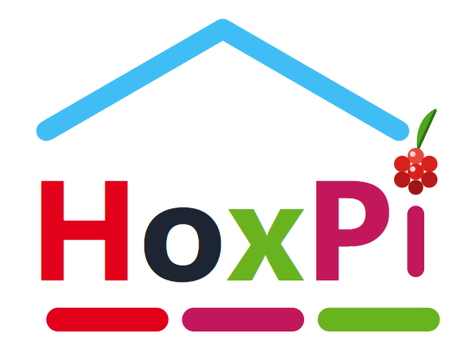
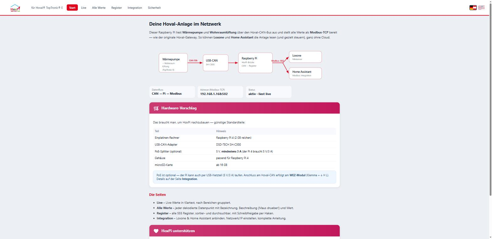
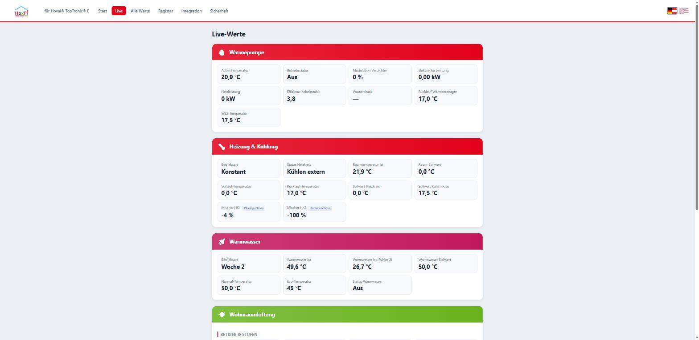
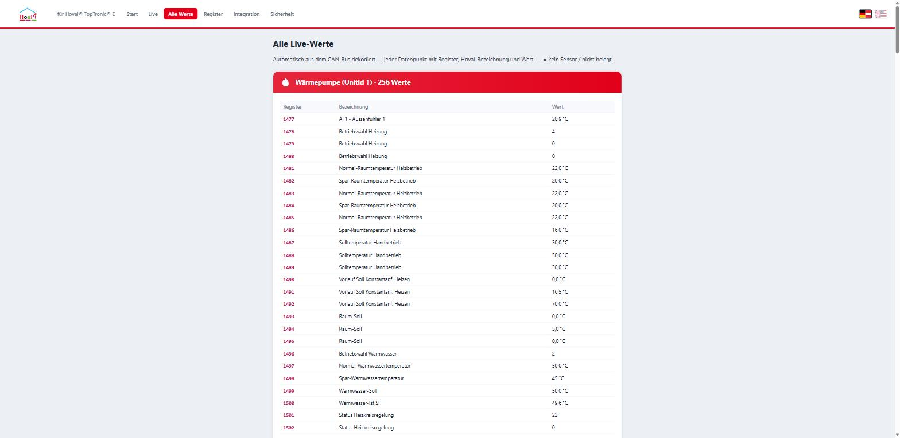
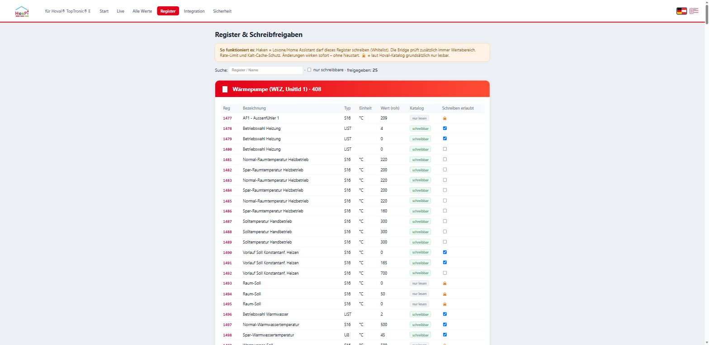
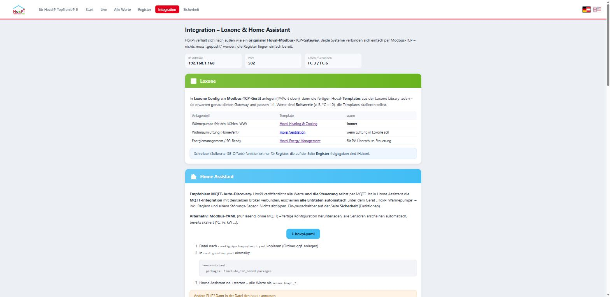
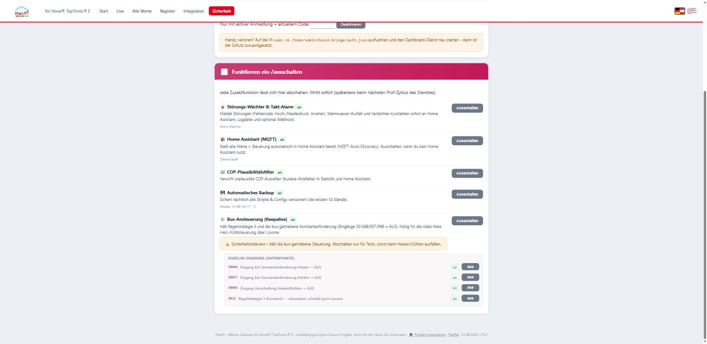
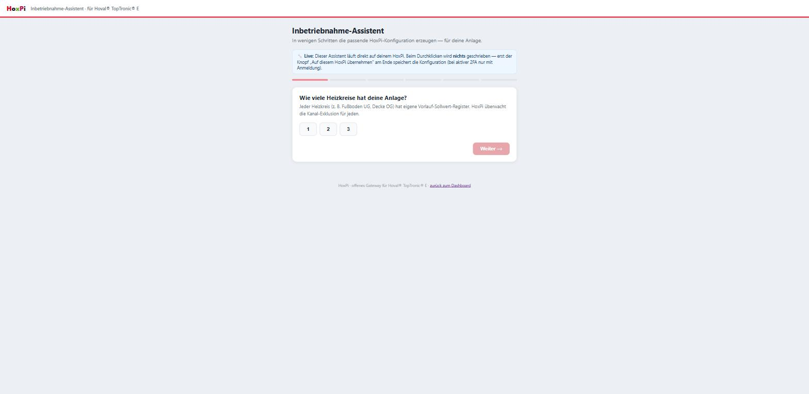

# HoxPi — open gateway for Hoval® TopTronic® E

[](https://buymeacoffee.com/bernhardsu9) [](https://www.paypal.com/donate/?hosted_button_id=HWBBHDSVD3MCC)

**Raspberry Pi + USB-CAN adapter = a drop-in replacement for the Hoval Modbus gateway.**
HoxPi passively reads the CAN bus of a Hoval® TopTronic® E system (heat pump, ventilation, buffer module) and exposes every datapoint as **Modbus-TCP (port 502)** — exactly like the original HovalConnect Modbus gateway. The official **Loxone Hoval templates work 1:1**, Home Assistant gets a ready-made config, and an optional **Grafana stack** provides long-term charts. Entirely local, no cloud.

> **Disclaimer:** Independent open-source project, **not affiliated with Hoval AG**. Hoval® and TopTronic® are trademarks of Hoval AG. Use at your own risk — you are interfacing with your own heating system.

## Features

- **Modbus-TCP gateway emulation** — register numbers match the official Hoval datapoint list, so the official Loxone Library templates (Heating & Cooling, Ventilation, Energy Management) work without modification
- **Safe writing**: default read-only; writes require an explicit per-register whitelist **plus** value-range check, rate limit and cold-cache protection
- **Web dashboard** (port 80, DE/EN): live values in plain language, all registers with descriptions (hover tooltips), sortable/searchable register table with **write-permission checkboxes**, integration guide, network/IP configuration
- **Home Assistant**: auto-generated Modbus package (`hoxpi.yaml` download) + optional MQTT with auto-discovery
- **Grafana statistics** (optional, can be toggled on/off in the dashboard): Prometheus exporter → Prometheus (400 days retention) → provisioned Grafana dashboard (temperatures, power, COP, Smart Grid, daily energy)
- **SG-Ready / PV surplus**: full support for Hoval's Smart Grid offset registers (Use Case 8 of the Hoval Modbus guideline)
- **Fault watcher & short-cycle alarm** with **in-dashboard configuration** (Security page: thresholds for starts/h, DHW drop, webhook URL, MQTT) - no file editing needed
- **History charts** (`/verlauf`, 24h/7d/30d) and a **newly discovered datapoints** card (catalogue cross-check) on the dashboard
- **AI interface (MCP)**: built-in [Model Context Protocol](https://modelcontextprotocol.io) server (`http://<pi-ip>:8808/mcp`) — AI assistants like Claude can inspect the system live, explain values, analyse Prometheus history and diagnose faults in plain language. Add it to **Claude Desktop** via `mcp-remote` in `claude_desktop_config.json` (needs Node.js; exact snippet on the dashboard's *Integration* page — Claude's hosted "custom connectors" require a public https URL, so the local bridge is the way to go on a home network). Writing via MCP is **off by default** (`config.json: enable_write`) and always requires explicit confirmation plus all bridge safeguards

## Screenshots

Live dashboard on the Pi (port 80) — no cloud, German/English:

| Start | Live values |
|---|---|
|  |  |

| All decoded datapoints | Registers & write permissions |
|---|---|
|  |  |

| Loxone / Home Assistant integration | Feature toggles & 2FA |
|---|---|
|  |  |

| Commissioning wizard (live on the Pi) | |
|---|---|
|  | |

## Hardware

| Part | Note |
|---|---|
| Raspberry Pi 4 | 2 GB RAM is plenty |
| USB-CAN adapter | tested: DSD-TECH SH-C30G |
| microSD ≥ 16 GB, PSU 5 V/3 A | PoE splitter works too |

CAN wiring: tap the bus **in parallel** at the Hoval **WEZ module**, terminal "+ ⏚ H L" (H/L/GND). The existing bus keeps running — HoxPi listens passively and polls politely. **Do not** use terminal X4 (that is RS-485, not CAN).

## Install

**Quick install** (Raspberry Pi OS / Debian, flash with the Raspberry Pi Imager and enable SSH there, then):

```bash
git clone https://github.com/newstedaut/HoxPi.git hoxpi && cd hoxpi
bash install.sh --dry-run    # preflight only (Python, CAN adapter, files) - shows what would happen, changes nothing
sudo bash install.sh --yes   # fully automatic incl. Grafana; omit --yes for interactive
```

Afterwards open `http://<pi-ip>/` — done. Recommended first step: set up 2FA on the *Security* page.

The installer asks to download the **official Hoval datapoint list** (xlsx) from hoval.com — it is **not** included in this repository for copyright reasons. Two small generators (`tools/gen_registers.py`, `tools/gen_reg_texts.py`) build `registers.json` (register map) and `reg_texts.json` (names + descriptions DE/EN) from it locally.

> **Note on datapoint-list versions & controller firmware:** Hoval extends the datapoint list over time (tested up to **V2-11-12 / rev. ≥2.38**, which added e.g. *room setpoint cooling* and refrigerant-circuit diagnostics). HoxPi accepts any list version — datapoints your controller firmware does not know simply never answer on the CAN bus and stay empty. That is expected, not an error. Rule of thumb: the newer your TopTronic E controller firmware, the more of the new datapoints will respond.
>
> **Auto-update:** `tools/update_datapoints.py --check|--apply [--restart]` downloads the current list, regenerates both JSON files when it changed (with backups and a sanity check) and can restart the bridge. Optional monthly timer: `systemd/hoval-datapoints-update.{service,timer}` — so the register map keeps itself up to date, e.g. after a Hoval service visit updated the controller firmware.

## Security notes

- **Two-factor authentication (TOTP)**: on the dashboard's *Security* page you can protect all write actions (register permissions, network/IP config, statistics toggle) with any authenticator app (Google/Microsoft Authenticator, Aegis, 1Password …) — scan the QR code, done. Sign-in lasts 30 days per browser; reading stays open. Strongly recommended before exposing the dashboard to a shared network
- Run in a **trusted home network**; nothing leaves your network — no cloud, no telemetry
- Writing starts disabled except for a small, curated whitelist; every write is additionally validated (range, rate limit, cold-cache)

## Credits & thanks

Protocol knowledge builds on the great reverse-engineering work of
[hpoeckl/hoval-exporter](https://github.com/hpoeckl/hoval-exporter) (MIT),
[zittix/Hoval-GW](https://github.com/zittix/Hoval-GW),
[chrishrb/hoval-gateway](https://github.com/chrishrb/hoval-gateway) (Apache-2.0) and
[parren/hoval-ultrasource-agent](https://github.com/parren/hoval-ultrasource-agent) (MIT).
No code was copied from these projects; HoxPi is an independent implementation.

Special thanks to:

- **Dr. Waag / MyHome-Control** — [myhome-control.de](https://www.myhome-control.de) — for generously sharing deep TopTronic-E parameter know-how. Well worth a look for Loxone-friendly hardware (CAN gateways, WLED controllers).
- **[nliaudat/esp_canbus](https://github.com/nliaudat/esp_canbus)** and everyone contributing to the shared, community-maintained [Hoval datapoint catalogue](https://github.com/newstedaut/hoval_datapoints).
- **[ivantichy/loxone-mcp-proxy](https://github.com/ivantichy/loxone-mcp-proxy)** for the Loxone MCP groundwork.
- The whole **Hoval / Loxone / Home Assistant** community — and everyone who tests, reports and improves HoxPi. 🙏

## Support

HoxPi is free and develops in my spare time. If it saves you the commercial gateway, consider [buying me a coffee ☕](https://buymeacoffee.com/bernhardsu9) or [donating via PayPal](https://www.paypal.com/donate/?hosted_button_id=HWBBHDSVD3MCC) — it funds test hardware and keeps the project going.

## License

[MIT](LICENSE)

---

# HoxPi — offenes Gateway für Hoval® TopTronic® E (Deutsch)

**Raspberry Pi + USB-CAN-Adapter = Ersatz für den Hoval-Modbus-Gateway.**
HoxPi liest den CAN-Bus einer Hoval® TopTronic® E-Anlage (Wärmepumpe, Wohnraumlüftung, Puffermodul) passiv mit und stellt alle Datenpunkte als **Modbus-TCP (Port 502)** bereit — exakt wie der originale HovalConnect-Modbus-Gateway. Die offiziellen **Loxone-Hoval-Templates laufen 1:1**, Home Assistant bekommt eine fertige Konfiguration, optional gibt es einen **Grafana-Stack** für Langzeit-Diagramme. Komplett lokal, keine Cloud.

> **Hinweis:** Unabhängiges Open-Source-Projekt, **nicht mit der Hoval AG verbunden**. Hoval® und TopTronic® sind Marken der Hoval AG. Nutzung auf eigene Gefahr — es geht um deine Heizung.

## Funktionen

- **Modbus-TCP-Gateway-Emulation** — Registernummern exakt nach offizieller Hoval-Datenpunktliste, offizielle Loxone-Templates (Heating & Cooling, Ventilation, Energy Management) passen ohne Anpassung
- **Sicheres Schreiben**: standardmäßig read-only; Schreiben nur per Register-Whitelist **plus** Wertebereichsprüfung, Rate-Limit und Kalt-Cache-Schutz
- **Web-Dashboard** (Port 80, DE/EN): Live-Werte in Klartext, alle Register mit Beschreibung (Maus-Tooltip), sortier- und durchsuchbare Registertabelle mit **Schreibfreigabe-Checkboxen**, Integrations-Anleitung, Netzwerk-/IP-Konfiguration
- **Home Assistant**: automatisch erzeugtes Modbus-Package (`hoxpi.yaml`-Download) + optional MQTT mit Auto-Discovery
- **Grafana-Statistik** (optional, im Dashboard ein-/ausschaltbar): Exporter → Prometheus (400 Tage) → fertiges Grafana-Dashboard (Temperaturen, Leistung, COP, Smart Grid, Tagesenergie)
- **SG-Ready / PV-Überschuss**: volle Unterstützung der Hoval-Smart-Grid-Offset-Register (Use Case 8 der Hoval-Modbus-Guideline)
- **KI-Schnittstelle (MCP)**: eingebauter [Model-Context-Protocol](https://modelcontextprotocol.io)-Server (`http://<pi-ip>:8808/mcp`) — KI-Assistenten wie Claude können die Anlage live inspizieren, Werte erklären, die Historie auswerten und Fehler eingrenzen. Einbindung in **Claude Desktop** per `mcp-remote` in der `claude_desktop_config.json` (braucht Node.js; der fertige Block steht auf der Dashboard-Seite *Integration* — Claudes gehostete „Custom Connectors" verlangen eine öffentliche https-Adresse, im Heimnetz ist die lokale Brücke der richtige Weg). Schreiben via MCP ist **standardmäßig aus** (`config.json: enable_write`) und verlangt immer eine explizite Bestätigung plus alle Bridge-Sicherungen

- **Relais-freier Original-Template-Betrieb**: Kanal-Exklusion (nur ein Sollwert-Register je Heizkreis) + Keepalive hält die Eingänge 30-046/057/066 = AUS → das **unveränderte** Hoval-Template steuert Heizen/Kühlen **kontaktlos**, ganz ohne Drahtbrücke oder Relais
- **Störungs-Wächter & Verdichter-Kurzzyklus-Alarm**: meldet Fehlercodes, Hoch-/Niederdruck, Warmwasser-Ausfall und Kurztakten sofort an Home Assistant, Logdatei und optional Webhook; Schwellen und Webhook direkt im Dashboard einstellbar (Sicherheit → Störungs-Wächter → „Schwellen & Webhook“)
- **Verlaufs-Graphen** (`/verlauf`, 24h/7d/30d) und Karte „Neu entdeckte Datenpunkte“ (Katalogabgleich) im Dashboard
- **Automatisches Backup**: nächtliche, versionierte Sicherung aller Skripte & Configs
- **Funktions-Schalter** (Dashboard → *Sicherheit*): jede Zusatzfunktion einzeln ein-/ausschaltbar (inkl. jedem Keepalive-Eingang), hinter 2FA
- **Inbetriebnahme-Assistent** (`assistant/hoxpi_assistent.html`): geführtes, browserbasiertes Setup, erzeugt die passende `hoxpi-features.json` (Trockentest, schreibt nichts); live am Pi (`/assistent`) lädt er die bestehende Konfiguration und belegt alle Schritte vor, der Knopf „Übernehmen“ schreibt sie (2FA)

## Screenshots

Das Dashboard läuft direkt am Pi (Port 80) — ohne Cloud, Deutsch/Englisch umschaltbar:

| Startseite | Live-Werte |
|---|---|
|  |  |

| Alle dekodierten Datenpunkte | Register & Schreibfreigaben |
|---|---|
|  |  |

| Integration Loxone / Home Assistant | Funktionen ein-/ausschalten & 2FA |
|---|---|
|  |  |

| Inbetriebnahme-Assistent (live am Pi) | |
|---|---|
|  | |

## Installation

Ausführliche Schritt-für-Schritt-Anleitung: **[INSTALL.md](INSTALL.md)**. Kurzform:

```bash
git clone <dieses Repo> && cd hoxpi
bash install.sh --dry-run    # optional: Trockenlauf, ändert nichts
sudo bash install.sh
```

Der Installer fragt nach der **offiziellen Hoval-Datenpunktliste** (xlsx) von hoval.com — sie ist aus Urheberrechtsgründen **nicht** im Repo enthalten. Zwei Generatoren (`tools/`) erzeugen daraus lokal `registers.json` und `reg_texts.json` (Namen + Beschreibungen DE/EN).

> **Hinweis zu Listen-Versionen & Regler-Firmware:** Hoval erweitert die Datenpunktliste laufend (getestet bis **V2-11-12 / Rev. ≥2.38**, neu darin z. B. *Raumsolltemperatur Kühlbetrieb* und Kältekreis-Diagnose). HoxPi kommt mit jeder Listenversion klar — Datenpunkte, die deine Regler-Firmware nicht kennt, antworten am CAN einfach nie und bleiben leer. Das ist normal, kein Fehler. Faustregel: je neuer die TopTronic-E-Regler-Firmware, desto mehr der neuen Datenpunkte antworten.
>
> **Auto-Update:** `tools/update_datapoints.py --check|--apply [--restart]` laedt die aktuelle Liste, erzeugt bei Aenderung beide JSONs neu (mit Backup + Sanity-Check) und kann die Bridge neu starten. Optionaler Monats-Timer: `systemd/hoval-datapoints-update.{service,timer}` — so haelt sich die Registerkarte selbst aktuell, z. B. nachdem der Hoval-Service die Regler-Firmware aktualisiert hat.

## Sicherheit

- **Zwei-Faktor-Authentifizierung (TOTP)**: Auf der Dashboard-Seite *Sicherheit* lassen sich alle Schreibaktionen (Register-Freigaben, Netzwerk/IP, Statistik-Schalter) mit jeder Authenticator-App schützen (Google/Microsoft Authenticator, Aegis, 1Password …) — QR-Code scannen, fertig. Anmeldung hält 30 Tage pro Browser; Lesen bleibt frei. Vor dem Betrieb in geteilten Netzen dringend empfohlen
- Im **vertrauenswürdigen Heimnetz** betreiben; es verlässt nichts dein Netzwerk — keine Cloud, keine Telemetrie
- Schreiben ist ab Werk auf eine kleine, geprüfte Whitelist beschränkt; jeder Write wird zusätzlich validiert

## Danksagung

Das Protokoll-Wissen baut auf der Reverse-Engineering-Arbeit von
[hpoeckl/hoval-exporter](https://github.com/hpoeckl/hoval-exporter) (MIT),
[zittix/Hoval-GW](https://github.com/zittix/Hoval-GW),
[chrishrb/hoval-gateway](https://github.com/chrishrb/hoval-gateway) (Apache-2.0) und
[parren/hoval-ultrasource-agent](https://github.com/parren/hoval-ultrasource-agent) (MIT) auf.
Es wurde kein Code übernommen — HoxPi ist eine eigenständige Implementierung.

Besonderer Dank an:

- **Dr. Waag / MyHome-Control** — [myhome-control.de](https://www.myhome-control.de) — für das großzügige Teilen von tiefem TopTronic-E-Parameterwissen. Ein Blick lohnt sich für Loxone-freundliche Hardware (CAN-Gateways, WLED-Controller).
- **[nliaudat/esp_canbus](https://github.com/nliaudat/esp_canbus)** und alle, die am gemeinsamen, community-gepflegten [Hoval-Datenpunkt-Katalog](https://github.com/newstedaut/hoval_datapoints) mitwirken.
- **[ivantichy/loxone-mcp-proxy](https://github.com/ivantichy/loxone-mcp-proxy)** für die Loxone-MCP-Grundlage.
- Die gesamte **Hoval- / Loxone- / Home-Assistant-Community** — und alle, die HoxPi testen, Fehler melden und verbessern. 🙏

## Unterstützen

HoxPi ist kostenlos und entsteht in meiner Freizeit. Wenn es dir den kommerziellen Gateway erspart: [Spendier mir einen Kaffee ☕](https://buymeacoffee.com/bernhardsu9) oder [per PayPal](https://www.paypal.com/donate/?hosted_button_id=HWBBHDSVD3MCC) — das finanziert Test-Hardware und hält das Projekt am Leben.

## Lizenz

[MIT](LICENSE)
